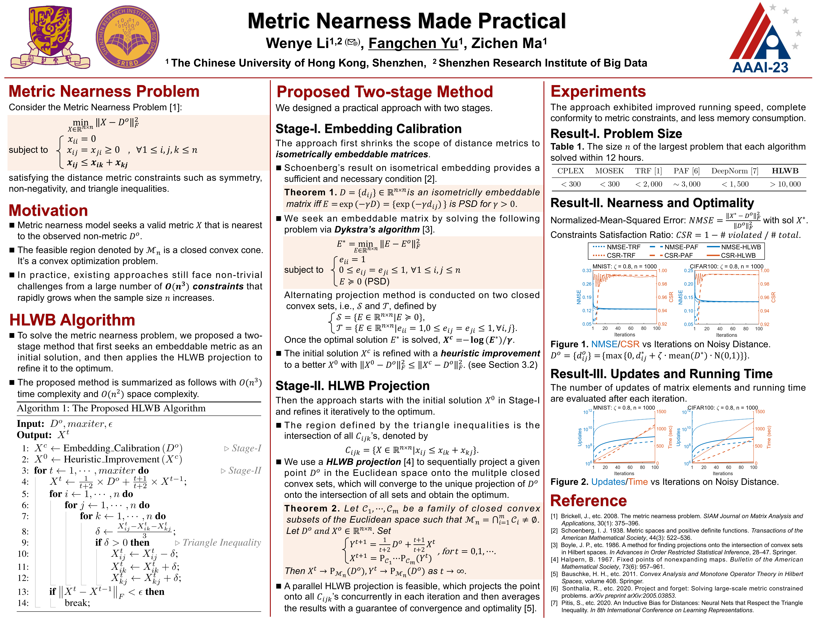

# AAAI'2023-Metric-Nearness-Made-Practical

The source code for the AAAI'2023 paper titled "**Metric Nearness Made Practical**".

## Introduction

This Github repository contains the implementation of our proposed ***HLWB*** (Halpern-Lions-Wittmann-Bauschke) algorithm, designed to efficiently solve the ***metric nearness problem***, especially for the large-scale problems.

- **Metric Nearness Problem**: Given a non-metric distance matrix $D^o \in \mathbb{R}^{n \times n}$, the metric nearness problem is to seek a valid metric $X \in \mathbb{R}^{n \times n}$ that is nearest to the observation $D^o$ by:

  $$ \min_{X} ||X - D^o||_F^2 $$

  $$
    \min_{X} ||X - D^o||_F^2  s.t.  x_{ii} = 0,  x_{ij} = x_{ji} \ge 0,  x_{ij} \le x_{ik} + x_{kj},  \forall  1 \le i,j,k \le n
  $$

  In practice, existing approaches still face non-trivial challenges from a large number of $O(n^3)$ triangle inequalities that rapidly grows when the sample size $n$ increases.

Our work proposes a new solution to the metric nearness problem defned above. The solution is comprised of two stages.

- **Stage-I. Embedding Calibration**: Our method first shrinks the scope of distance metrics to *isometrically embeddable matrices*. The number of constraints is greatly reduced, which admits a fast solution with high quality by:

  $\min_{X \in \mathbb{R}^{n \times n}} \|X - D^o\|_F^2 ~~s.t.~~ x_{ii} = 0, x_{ij} = x_{ji} \ge 0, \exp(-\gamma X) \succeq 0,~\forall~1 \le i,j \le n$

- **Stage-II. HLWB Projection**: The
alternating projection stage iteratively refnes the approximate solution $X^o$ obtained in stage-I to the optimal one by:

  $\min_{X \in \mathbb{R}^{n \times n}} \|X - X^o\|_F^2 ~~s.t.~~ x_{ij} \le x_{ik} + x_{kj},~\forall~1 \le i,j,k \le n$

## Method

<p align="center">
    
</p>

## Folders and files

<pre>
./                              - Top directory.
./README.md                     - This readme file.
./demo.m                        - Demo of solving the metric nearness problem on a 200*200 matrix.
./demo_large.m                  - Demo of solving the metric nearness problem on a 1000*1000 matrix.
./ismetric.m                    - Check if a given matrix meet the distance metric requirements.

|data/                          - Noisy distance matrices
   ./sample.mat                 - A 200*200 noisy distance matrix and the ground-truth.
   ./sample_trf.txt             - The same 200*200 noisy distance matrix in TRF (Triangle Fixing Algorithm) input format.
   ./sample_large.mat           - A 1000*1000 noisy distance matrix and the ground-truth.
   ./sample_large_trf.txt       - The same 1000*1000 noisy distance matrix in TRF (Triangle Fixing Algorithm) input format.

|method/                        - Our proposed method.
   ./embedding_calibration.m    - Stage-I. Embedding Calibration.
   ./heuristic_improve.c        - Heuristic improvement of an approximate metric.
   ./heuristic_improve.mexa64   - MEX compiled heuristic_improve.c on linux x64.
   ./heuristic_improve.m        - If heuristic_improve.c can't be compiled, use this one.
   ./hlwb_projection.c          - Stage-II. HLWB Projection.
   ./hlwb_projection.mexa64     - MEX compiled hlwb_projection.c on linux x64.
   ./hlwb_projection.m          - If hlwb_projection.c can't be compiled, use this one.
</pre>

Link of baselines:

- *TRF* can be downloaded from: https://optml.mit.edu/work/soft/metricn.html

- *PAF* can be downloaded from: https://github.com/rsonthal/ProjectAndForget

- *DeepNorm* can be downloaded from: https://github.com/spitis/deepnorms

## Citation

If you find this code useful for your research, please use the following BibTeX entry.

```
@inproceedings{li2023metric,
  title={Metric nearness made practical},
  author={Li, Wenye and Yu, Fangchen and Ma, Zichen},
  booktitle={Proceedings of the AAAI Conference on Artificial Intelligence},
  volume={37},
  number={7},
  pages={8648--8656},
  year={2023}
}
```

```
@inproceedings{li2022calibrating,
  title={Calibrating Distance Metrics Under Uncertainty},
  author={Li, Wenye and Yu, Fangchen},
  booktitle={Joint European Conference on Machine Learning and Knowledge Discovery in Databases},
  pages={219--234},
  year={2022},
  organization={Springer}
}
```

```
@incollection{yu2023highly,
  title={Highly-efficient Robinson-Foulds distance estimation with matrix correction},
  author={Yu, Fangchen and Bao, Rui and Mao, Jianfeng and Li, Wenye},
  booktitle={European Conference on Artificial Intelligence},
  pages={2914--2921},
  year={2023},
  publisher={IOS Press}
}
```


## Contact

The code can be freely distributed and modified for non-commercial purposes.

For commercial usage, please contact Professor Wenye Li (wyli@cuhk.edu.cn) and Fangchen Yu (fangchenyu@link.cuhk.edu.cn).
